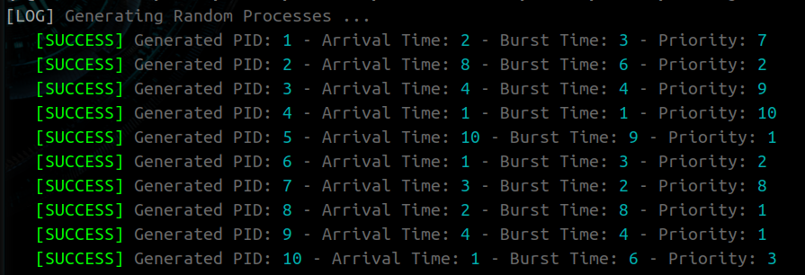
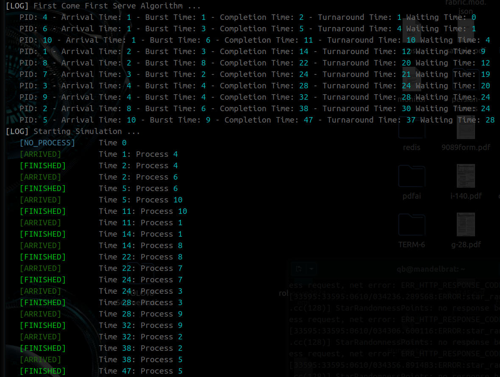
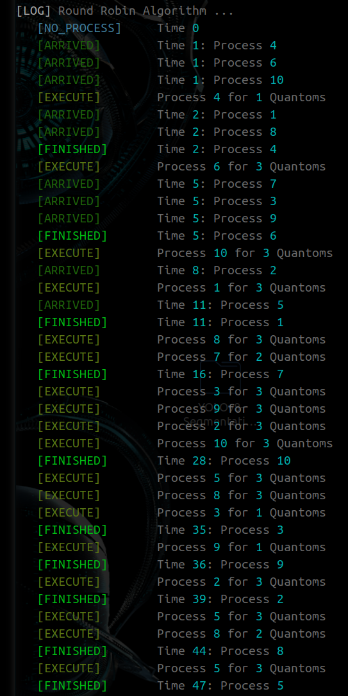

# Process-Scheduling-Algorithms
Implementation of  a Simulation Tool that Allows Users to Explore and Compare the Performance of Various Process Scheduling Algorithms in the Context of an Operating System  

⚠️ This Repository is Under Development for More Algorithms and Supports

## Details
First i Generated Random Processes, then Used Non-Preemptive and Preemptive Process Scheduling Algorithms

## Generating Random Processes
<p align="center" style="position: relative;">
  
</p>

## Using Non-Preemptive Algorithms
Here is Sample Output of ```FCFS``` Algorithm
<p align="center" style="position: relative;">
  
</p>

## Using Preemptive Algorithms
Here is Sample Output of ```RR``` Algorithm
<p align="center" style="position: relative;">
  
</p>
